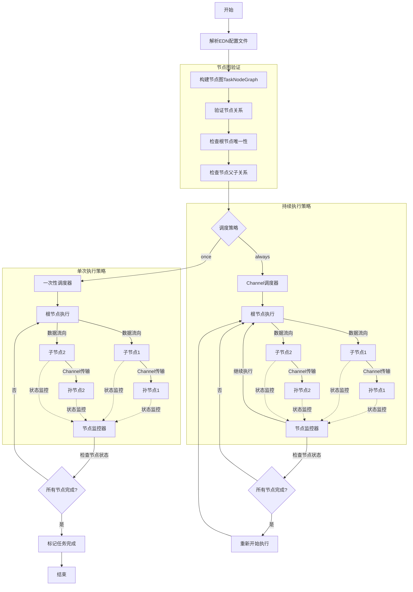
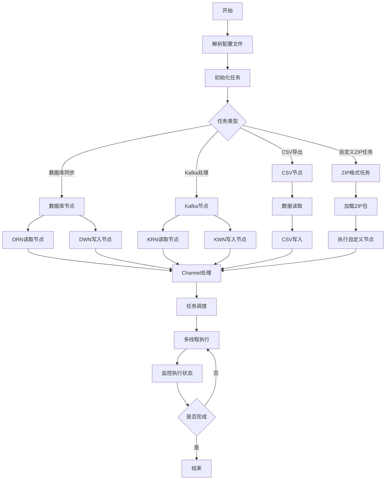

# 中文 | [英文](./README_EN.md)

# Cissy

Cissy 是一个基于 Clojure的数据同步工具，支持多种数据库之间的数据迁移和同步。


主要功能流程图

以节点执行为维度，功能流程图


## 功能特性

- 支持多种数据库：SQLite、MySQL、PostgreSQL、Oracle
- 支持分页查询和批量写入
- 基于配置文件的任务定义
- 支持数据同步进度跟踪
- 支持 JVM Clojure

## 依赖要求

### JVM 环境
- Clojure 1.11.1+
- Java 11+

## 安装

### 使用 deps.edn (JVM 环境)
```sh
clojure -T:build clean
clojure -T:build uber
```

### 运行
```sh
java -jar cissy.jar start -c {edn格式配置的绝对路径}
```
[`edn`格式](https://github.com/edn-format/edn)
> `edn`相比`json` 更简单、支持更多数据类型、在`clojure`生态中更好用、可扩展性

clojure环境下可以使用如下命令启动
```sh
clojure -m cissy.app start -c {edn格式配置的绝对路径}
```

### 样例
可以通过如下命令生成一个示例配置文件
```sh
java -jar cissy.jar demo
```
如何想开发一个自定义的外挂`zip`格式任务节点，你可以使用
```
java -jar cissy.jar demo -z
```
生成一个`zip_task_demo.zip` 样例，默认保存在桌面目录下，然后基于这个样例开发，改压缩包中也提供`zip`格式任务一些配置示例


### 已内置节点列表
| 节点名称 | 节点主要功能 | 节点主要配置参数 |
| ---- | ---- | ---- |
| `drn` | 从数据库读取加载数据 |  [`drn`配置项](#drnConfigItem)  |
| `dwn` | 往数据库写入数据 | [`dwn`配置项](#dwnConfigItem)  |
| `csvw` | 往`csv`文件写入数据 | [`csvw`配置项](#csvwConfigItem) |
| `console` | 控制台打印数据,一般调试或者观察数据用 | 无 |
| `krn` | 从`kafka`中`poll`数据 | [`krn`配置项](#krnConfigItem) |

<a name="drnConfigItem"></a>
#### `drn`配置项
```edn
{
    :from_table   "users"
    :from_db      "xx"
    :sql_template "select * from users1 order by id"
    :threads      1
    :page_size    10000
}
```

<a name="dwnConfigItem"></a>
#### `dwn`配置项
```edn
{
    :to_table "users"
    :from_db  "xx"
    :threads  2
}
```

<a name="csvwConfigItem"></a>
#### `csvw`配置项
```edn
{
    :target_file "{绝对路径/xx.csv}"
    :threads     1
}
```

<a name="krnConfigItem"></a>
#### `krn`配置项
```edn
{
    :topic "test-topic"
    :from_db "main"
    :threads 5
}
```

> 自定义节点时，节点名称不能和内置冲突，可能导致一些问题

### 单元测试
`clojure`的单元测试必须以`_test`结尾, 执行命令
```sh
clojure -M:test
```


